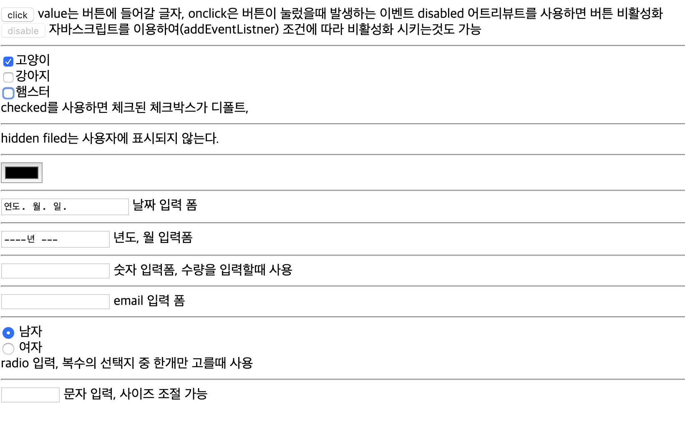

HTTP 프로토콜 간략,  
input 태그
<!--more-->

## HTTP Protocol
어제 잠깐 post, get 공부하다가 http 프로토콜이 갑자기 생각나서 다시 책을 읽어보았음. 
  
### HTTP
클라이언트와 웹 서버 사이에서 데이터를 주고받기 위해 사용하는 통신방식   
이름은 하이퍼 텍스트 트랜스퍼 프로토콜이지만, 하이퍼 텍스트뿐만 아니라 이미지, 동영상
스크립트 등 컴퓨터가 다루는 모든 데이터를 전송할 수 있음  
  
우리가 웹브라우저에서 www.google.com을 입력하면 웹 클라이언트와 웹 서버 간에 HTTP 연결이
맺어지고, 웹 클라이언트는 웹 서버에 HTTP Request (요청)메세지를 보낸다. 웹 서버는 이 Request에 따른
처리를 진행하고, 그 결과를 HTTP Response (응답)메세지로 보냄, 이런 과정이 반복되며 웹을 사용함  
  
요청 메세지를 보낼 때 어떤 요청방식인지 (get, post, put, delete) 요청 URL, 프로토콜 버전 메세지의 최상단 스타트라인에 명시된다.   
  
응답 메세지의 경우 스타트라인에 프로토콜 버전, 상태코드(200,400과 같은 코드), 상태 텍스트가 명시됨  
  
HTTP 메세지의 상세 및 get과 post외의 메쏘드는 나중에 차차 작성예정

  
---

## input 태그

form 태그중 가장 중요한 태그로 사용자의 데이터를 입력받기 위해 사용된다.   
  
input 태그는 다양한 종류가 존재하며 type 어트리뷰트에 의해 구분됨  
  
form태그 내에 존재해야 입력 데이터를 전송할 수 있다. 
  
서버에 전송되는 데이터는 name과 value 어트리뷰트가 가 각각 키와 값의 형태로 되어 전송된다.
  
### code예제

~~~html
<!DOCTYPE html>
    <html>
    <head>
        <meta charset="UTF-8">
    </head>
    <body>
        <form>
            <input type="button" value="click" onclick="alert('Hello,World')"> 
            value는 버튼에 들어갈 글자, onclick은 버튼이 눌렀을때 발생하는 이벤트
            disabled 어트리뷰트를 사용하면 버튼 비활성화  
            <input type="button" value="disable" onclick="alert('no way!')" disabled>
            자바스크립트를 이용하여(addEventListner) 조건에 따라 비활성화 시키는것도 가능
            

    
            <input type="checkbox" name="pet1" value="cat" checked>고양이 
            <input type="checkbox" name="pet2" value="dog">강아지 
            <input type="checkbox" name="pet3" value="hamster">햄스터 
            checked를 사용하면 체크된 체크박스가 디폴트, 
            

    
            <input type="hidden" name="country" value="Korea">
            hidden filed는 사용자에 표시되지 않는다.
            

            <input type="color" name="favoritecolor">
            

    
            <input type="date" name="flightday">
            날짜 입력 폼
            

    
            <input type="month" name="startmonth">
            년도, 월 입력폼
            

    
            <input type="number" name="quantity">
            숫자 입력폼, 수량을 입력할때 사용
            

    
            <input type="email" name="usermail">
            email 입력 폼
            

    
            <input type="radio" name="gender" value="male" checked> 남자 
            <input type="radio" name="gender" value="female"> 여자 
            radio 입력, 복수의 선택지 중 한개만 고를때 사용
            

            <input type="text" name="username" minlength="4" maxlength="8" size="10">
            문자 입력, 사이즈 조절 가능
        </form>
    </body>
    </html>
~~~
  
  
### 실행결과

